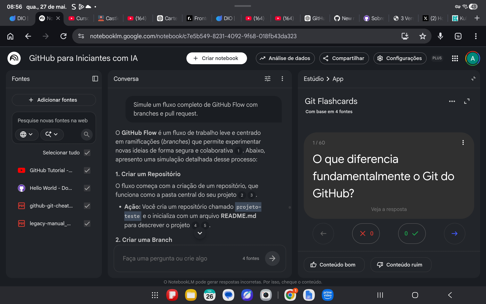

# estudos-github-notebooklm
Caderno de estudos sobre Git e GitHub desenvolvido com IA, reunindo conceitos, prompts e práticas de versionamento para aprendizado ativo.

# GitHub para Iniciantes com IA

## Objetivo

Este projeto tem como objetivo estudar os conceitos básicos do GitHub utilizando IA e NotebookLM como ferramentas de aprendizagem ativa.

O foco foi compreender:
- criação de repositórios;
- documentação;
- uso do README;
- organização de projetos.

---

## Fontes Utilizadas

Vídeo introdutório sobre GitHub
 YouTube - Introdução ao GitHub
Guia oficial Hello World do GitHub
 GitHub Docs - Hello World
Material complementar em PDF 1
 PDF Complementar 1
Material complementar em PDF 2
 PDF Complementar 2

---

## Prompts Utilizados

### Prompt 1
"Com base no material, descreva um passo a passo simples para criar meu primeiro repositório no GitHub."

### Objetivo
Entender na prática como criar um repositório utilizando a interface do GitHub.

### Resultado Obtido
A IA apresentou um fluxo organizado e simples desse passo a passo.

---

### Prompt 2
"Crie um resumo em tópicos com os conceitos mais importantes apresentados nos documentos."

### Objetivo
Transformar conteúdos extensos em um material de revisão rápida e estruturada.
### Resultado Obtido
Enriqueceu o repertório do chat e somou bastante para os flashcards.

---

### Prompt 3
"Crie 10 perguntas e respostas sobre os conteúdos estudados."

### Objetivo
Criar uma forma prática de revisão e fixação do conteúdo.

### Resultado Obtido
As perguntas foram utilizadas na ferramenta de flashcards do NotebookLM para reforçar a memorização dos conceitos principais.

## Uso dos Flashcards

Além dos prompts textuais, utilizei a funcionalidade de flashcards do NotebookLM para revisar conceitos importantes com um uso ativo da ferramenta.

---

## Miniguia de Estudos

### Conceitos principais

- Git: sistema de versionamento.
- GitHub: plataforma para hospedar projetos Git.
- README: documentação inicial do projeto.
- Commit: registro de alterações.
- Branch: ramificação de desenvolvimento.
- Merge: união de alterações de branches diferentes.
- Pull / Push: sincronização entre repositório local e remoto.

---

## Glossário

| Termo | Significado |
|---|---|
| Git | Sistema de controle de versão distribuído usado para acompanhar alterações em arquivos e projetos. |
| GitHub | Plataforma online baseada em Git para hospedagem, colaboração e gerenciamento de projetos. |
| Repositório (Repository) | Espaço onde os arquivos do projeto e todo o histórico de alterações ficam armazenados. |
| Commit | Registro permanente de alterações realizadas no projeto. Funciona como um “snapshot” do estado do projeto naquele momento. |
| Branch | Ramificação criada para desenvolver funcionalidades ou testar mudanças sem alterar a versão principal do projeto. |
| Main/Master | Branch principal do repositório, geralmente considerada a versão estável do projeto. |
| Pull Request | Solicitação para revisar e integrar alterações feitas em uma branch ao projeto principal. |
| Merge | Processo de unir alterações de diferentes branches em uma única versão do projeto. |
| Conflito de Merge | Situação em que o Git não consegue unir automaticamente alterações feitas na mesma parte de um arquivo. |
| Clone | Cópia completa de um repositório remoto para o computador local. |
| Push | Envio das alterações locais para o repositório remoto no GitHub. |
| Pull | Atualização do repositório local com as alterações presentes no repositório remoto. |
| Fork | Cópia de um repositório para outra conta GitHub, permitindo alterações independentes do projeto original. |
| README.md | Arquivo utilizado para descrever e documentar o projeto. |
| Markdown | Linguagem simples de formatação de texto utilizada em READMEs, comentários e documentações no GitHub. |
| GitHub Flow | Fluxo de trabalho baseado em branches, commits, pull requests e merge para desenvolvimento colaborativo. |
| Issue | Ferramenta utilizada para registrar bugs, ideias, tarefas ou melhorias dentro de um projeto. |
| GitHub Desktop | Aplicativo com interface gráfica que facilita o uso do Git e GitHub sem precisar utilizar comandos no terminal. |
| Rebase | Estratégia utilizada para reorganizar ou simplificar o histórico de commits. |
| Reset | Comando utilizado para desfazer alterações ou retornar o projeto para um estado anterior. |
| Controle de Versão | Método utilizado para registrar e acompanhar alterações feitas em arquivos ao longo do tempo. |
---

## Prompts Reutilizáveis

- “Crie um passo a passo para iniciar um projeto no GitHub do zero.”
- "Crie um resumo em tópicos dos principais conceitos de Git e GitHub."
- "Transforme os conceitos em perguntas de flashcards."
- "Simule erros comuns de iniciantes e como corrigir."
-”Monte um exercício guiado usando GitHub Flow.”

## Resultado Visual do Estudo

